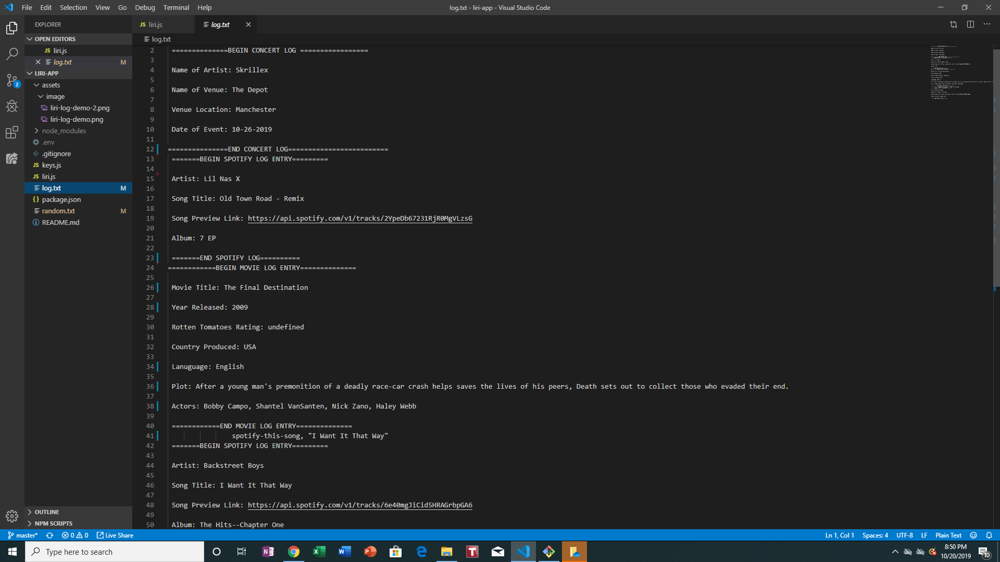

# liri-app

# DEMO:

<video src ="assets/video/liri-app-video-demo.mp4" width="500" height="350" controls preload></video>

**************************************************************************

# INTRODUCTION:

LIRI is compared to SIRI; however, it's an app that intreprets command languages using node.js. Once you send a command line, the back-end grab the parameters and gives you back the data you requested.

Ex: node liri.js spotify-this-song "The Middle"

***************************************************************************

# PACKAGES USED IN THIS APP

* [Node-Spotify-API] (https://www.npmjs.com/package/node-spotify-api)

* [Axios] (https://www.npmjs.com/package/axios)

* [OMDB API] (http://www.omdbapi.com)

* [Bands In Town API] (http://www.artists.bandsintown.com/bandsintown-api)

* [Moment] (https://www.npmjs.com/package/moment)

* [DotEnv] (https://www.npmjs.com/package/dotenv)

*************************************************************************

# INSTRUCTIONS

1. Run `npm init -y` in the terminal. This is the root of the app and it will initialize `package.json`. This is important because `package.json` is used to install third party packages and saving version numbers.

2. Create a `.gitignore` file. The following will not be commited to GitHub:

* node_modules

* DS_Store

* .env

3. Make a .js file called `keys.js`. This `keys.js` should be displayed by the following:
Ex: 

console.log('this is loaded')
exports.spotify = {
    id: process.env.SPOTIFY_ID,
   secret: process.env.SPOTIFY_SECRET
}

4. Create a file `.env`. This is where your Spotify API keys. Remember, they should not be commited to github. 

Ex: 

# Spotify API keys

SPOTIFY_ID=your-spotify-id
SPOTIFY_SECRET=your-spotify-secret

5. Create a file called `random.txt`. This is for the command-line do-what-it-says. 

6. Create a file called `liri.js`.

7. Put this code 'require("dotenv").config' at the first line of `liri.js`.

8. Add the code 'var keys = require ('./keys.js')' to import the `keys.js`.

9. Create a function for the commands. Create a switch so it can take these following commands:

* `concert-this`

* `spotify-this-song`

* `movie-this`

* `do-what-it-says`

*******************************************************************************

# COMMAND FUNCTIONS

`concert-this`- Displays the name of the venue, venue location. and date of the event (used by moment. It's display in this format: MM-DD-YYYY).

`spotify-this-song` - Displays the artists, song name, preview link, and the album that the song is from

`movie-this` - Displays the title of the movie, the year the movie came out, the IMDB Rating, the Rotten Tomatoes rating, the country where the movie was produced, the language(s) used in the movie, the plot, and the actors. 

`do-what-it-says` - Used the `fs` node package. This will let LIRI read the command inside the random.txt and displays in the terminal.

*******************************************************************************

# ADDITION

* Create a log.txt so it that the information that is displayed in the terminal can be saved in VS code.

